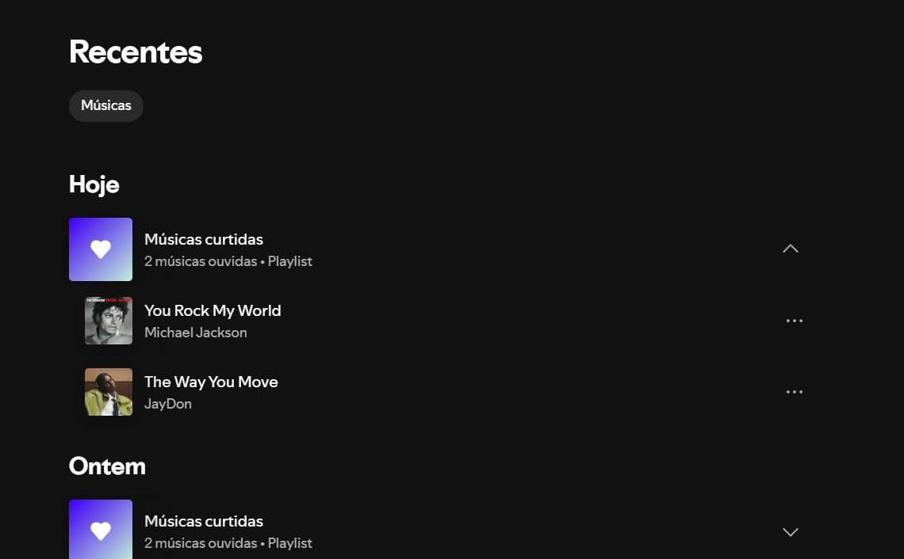
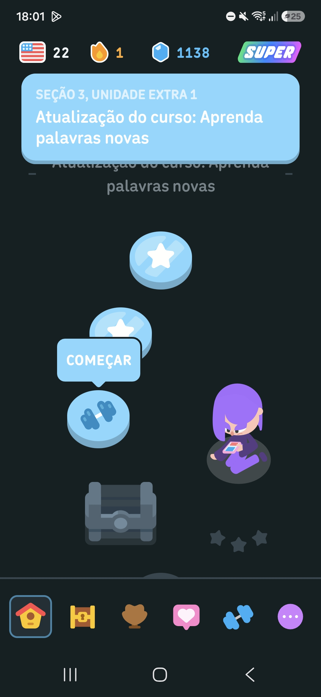
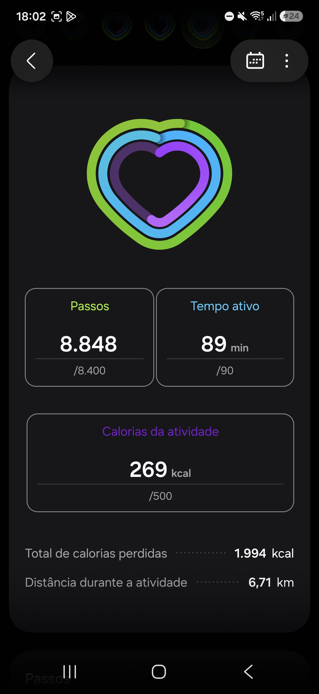
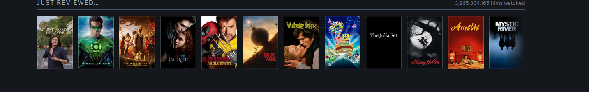

# Referências visuais

Quatro produtos digitais foram usados como referência. Nenhum é do universo de séries por
acaso: o problema do Continua é de **retomada e progresso**, e os produtos que melhor
resolvem isso estão em música, educação, saúde e cinema.

Para cada um: o que foi observado, onde entrou na nossa interface e por que é adequado.

---

## 1. Spotify — o histórico recente organizado por quando você ouviu

**O que foi observado.** O Spotify agrupa o que você ouviu por "Hoje", "Ontem", e assim por
diante. A organização não é alfabética nem por gênero: é por **recência**. O app parte do
princípio de que o motivo mais provável de você abri-lo é continuar algo que já estava
ouvindo, e por isso o mais recente fica sempre no topo.

**Onde foi usado.** Na página inicial (`Estante`). A série com interação mais recente ocupa
um cartão grande no topo, com pôster, nome e o próximo episódio já calculado
(`CartaoRetomada`). Para isso, cada série guarda o campo `atualizadoEm`, e a estante é
ordenada por ele antes de renderizar.

**Por que é adequado.** É exatamente a hipótese do nosso produto. Quem abre o Continua abre
porque vai assistir a alguma coisa agora, e na maioria das vezes é a série que estava
assistindo ontem. Ordenar por recência transforma a resposta principal em zero cliques. Se
a tela inicial fosse uma busca ou uma grade em ordem alfabética, o produto devolveria à
pessoa justamente o trabalho que ele existe para eliminar.

---

## 2. Duolingo — o app marca onde você parou, você não procura

**O que foi observado.** Na trilha do Duolingo, todas as lições parecem iguais — menos uma.
O balão "COMEÇAR" fica grudado exatamente na próxima lição que você tem que fazer. Você não
lê a trilha inteira nem lembra onde estava: o app aponta. Acima, a sequência de dias e os
contadores mantêm o progresso sempre visível.

**Onde foi usado.** No selo amarelo sobre o pôster de cada série da estante, que mostra
"T2 E5" — o próximo episódio, calculado pela função `proximoEpisodio`. E no componente
`BarraProgresso`, reaproveitado em quatro lugares: cartão de destaque, cards da estante,
lista de temporadas e ranking das estatísticas.

**Por que é adequado.** Uma série de 70 episódios é longa demais para a pessoa varrer a
lista procurando onde parou — é o mesmo problema da trilha do Duolingo, que também é longa
demais para ser lida. A solução é a mesma: em vez de mostrar tudo e deixar a pessoa
procurar, o app aponta o ponto exato. A barra de progresso responde "quanto falta" sem
exigir leitura, e o retorno visual imediato ao marcar um episódio dá sentido ao único
hábito de que o produto depende para funcionar.

---

## 3. Samsung Health — números pessoais em vez de números do sistema

**O que foi observado.** O resumo diário mostra pouca coisa e mostra grande: passos, tempo
ativo, calorias, em tipografia enorme, com a unidade em corpo menor ao lado e a meta logo
abaixo. Não são métricas de produto, são fatos sobre a pessoa. O detalhamento vem depois,
embaixo, em texto pequeno.

**Onde foi usado.** Na página `Estatisticas`. Três `CartaoNumero` no topo — tempo de tela,
episódios marcados e séries na estante — com o número em Fraunces grande e amarelo, o
rótulo em corpo normal e o detalhe em corpo menor, na mesma hierarquia de três níveis.
Embaixo, a lista série por série, ordenada por episódios assistidos.

**Por que é adequado.** Manter o registro dá um trabalhinho, e o Samsung Health mostra a
contrapartida certa: os números acumulados são a recompensa de quem registrou. "Você passou
6 dias na frente da TV" é um fato que só existe porque a pessoa marcou os episódios — o que
transforma a tarefa de registro em algo que rende alguma coisa de volta.

---

## 4. Letterboxd — o pôster como matéria-prima da interface

**O que foi observado.** O Letterboxd exibe os filmes como uma fileira densa de pôsteres,
encostados uns nos outros, sem título embaixo e sem moldura. O fundo é escuro justamente
para o pôster ser a única coisa colorida da tela. A identidade visual do app vem do
conteúdo, não de decoração aplicada por cima dele.

**Onde foi usado.** Na grade da estante e da busca, e no topo da página de série, onde o
pôster fica sobre a imagem de fundo escurecida a 28% de opacidade. O tema escuro (ameixa
profunda, `#17121C`) foi escolhido para essa finalidade, e o amarelo aparece só no que pede
ação: botões, barra de progresso e o selo do próximo episódio.

**Por que é adequado.** Pôster é como as pessoas reconhecem uma série — mais rápido do que
ler o nome. Numa estante de dez séries, esse reconhecimento visual é o que faz a varredura
da tela ser instantânea. Usar uma única cor de destaque sobre fundo escuro garante que, num
card, o olho vá primeiro para o pôster e depois para o selo "T2 E5" — que é a ordem em que
a informação é útil.

---

## O que ficou de fora e por quê

**Netflix** foi descartada como referência: a tela dela é feita para você escolher entre
milhares de títulos, e o Continua é feito para você não precisar escolher nada. Copiar as
fileiras infinitas de carrosséis empurraria o produto para descoberta, que não é o problema
escolhido.